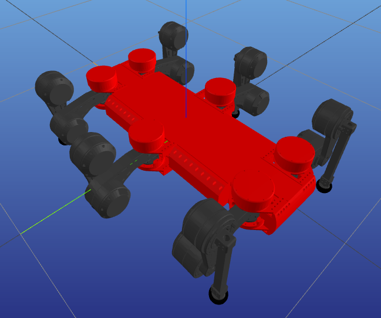

# IKFast warpper for c++ & python

## Usage

1. Use [IKFast Generator](https://www.hamzamerzic.info/ikfast_generator/) to generate your IK algorithm

- Note: for 3DTranslation there should be an intermediate link and joint between root link BASE and the arm (unknown reason)

2. Replace ikfast_gen.cpp with your file
3. Rename pybind module in CMakeLists.txt

```CMakeLists
## Settings
set(PYBIND_NAME <replace with your favored name>) # Change this to the name of your python module
```

4. Complie it.

```bash
mkdir build
cd build
cmake ..
make
```

or specifying python exec path

```bash
mkdir build
cd build
cmake .. -DPYTHON_EXECUTABLE=$(which python3)
make
```

5. Get your cpython module in /build

## Examples

Related cpp code is in `examples`.

### ElSpider

Leg config is axial symmetry.

```python
rot_mat = [0, np.pi/3*2, np.pi/3, -np.pi/3, -np.pi, -np.pi/3*2]
th_2 = self.rot_mat[foot_index]/2
m = pin.XYZQUATToSE3([0, 0, 0, 0, 0, np.sin(th_2), np.cos(th_2)])
pos = m.actInv(target)
sol = ik.IKFast_trans3D(list(pos))
```

### ElSpider Mini



Clockwise leg index in the img: [0, 2, 1, 4, 5, 3]

Default config q0:

- [-0.35350133 0.22998794 -0.13605704]
- [ 0.35350208 0.2299882 -0.1360569 ]
- [ 0.05350208 0.2899882 -0.1360569 ]
- [-0.35349792 -0.22998928 -0.1360562 ]
- [ 0.35350208 -0.22998902 -0.1360558 ]
- [ 0.05350208 -0.28998902 -0.1360558 ]

```python
from .pyikfast import pyikfast_el_mini as ik
from .pyikfast import pyikfast_el_mini_back as ik_back

JOINT_STATE_NAME = ["LB_HAA", "LB_HFE", "LB_KFE",
                    "LF_HAA", "LF_HFE", "LF_KFE",
                    "LM_HAA", "LM_HFE", "LM_KFE",
                    "RB_HAA", "RB_HFE", "RB_KFE",
                    "RF_HAA", "RF_HFE", "RF_KFE",
                    "RM_HAA", "RM_HFE", "RM_KFE"]

FOOT_LINK_NAME = ["LB_FOOT", "LF_FOOT", "LM_FOOT",
                  "RB_FOOT", "RF_FOOT", "RM_FOOT"]
target = [-0.35350133, 0.22998794, -0.13605704]
foot_index = 0
self.mirror_trans = [(np.array((1, 1, 1)), np.array((0, 0, 0))),
                      (np.array((1, -1, 1)), np.array((0, 0, 0))),
                      (np.array((1, -1, 1)), np.array((0.3, 0.06, 0))),
                      (np.array((1, -1, 1)), np.array((0, 0, 0))),
                      (np.array((1, 1, 1)), np.array((0, 0, 0))),
                      (np.array((1, 1, 1)), np.array((0.3, 0.06, 0)))]
pos = target*self.mirror_trans[foot_index][0] + \
    self.mirror_trans[foot_index][1]
if foot_index in [0, 3]:
    sol = ik_back.IKFast_trans3D(list(pos))
else:
    sol = ik.IKFast_trans3D(list(pos))
```
