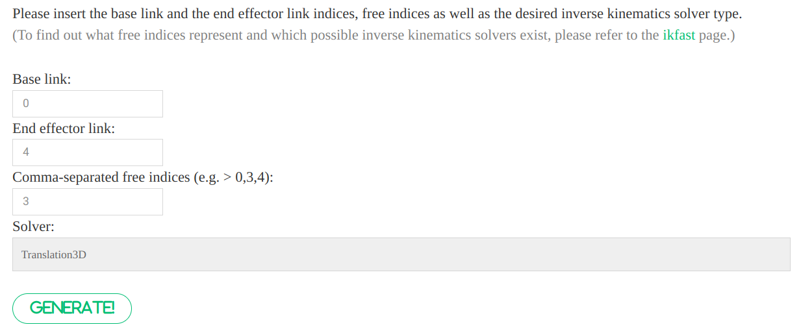

# IKFast warpper for c++ & python

## Usage

NOTE:

1. C++ lib generation **support multiple files**, but python binding generation **only support one file once a time**.
2. Temporarily this repo **only support 3D translation**. You can modify the interface to support more.

### [IKFast Generator](https://www.hamzamerzic.info/ikfast_generator/) Usage

After uploading your single leg URDF, links and indices will be displayed:

```txt
name            index parents
------------------------------
BASE            0
RF_HIP          1     BASE
RF_THIGH        2     RF_HIP
RF_SHANK        3     RF_THIGH
RF_FOOT         4     RF_SHANK
RF_KFE_CollBall 5     RF_THIGH
RF_HFE_CollBall 6     RF_HIP
------------------------------
```

Filling the blanks:



> [!WARNING]
> The third row should be filled with the index of the **JOINT** that will not change during the IK calculation, which is called `Free Joint` in `IKFast`. In this case, the joint between `RF_SHANK` and `RF_FOOT` is the `Free Joint`, so the index should be `3`.
> More details can be found in the [IKFast documentation](https://openrave.org/docs/latest_stable/openravepy/ikfast/).

Examples of IKFast generation can be found in folder [`cpp_demos_for_generation`](cpp_demos_for_generation).

### C++ lib generation

1. Use [IKFast Generator](https://www.hamzamerzic.info/ikfast_generator/) to generate your IK algorithm

   > Note: for 3DTranslation there should be an intermediate link and joint between root link BASE and the arm (unknown reason)

2. Add your generated files to /src

   For example:

   ```txt
   src
   ├── ikfast_leg1.cpp
   ├── ikfast_leg2.cpp
   └── ikfast_leg3.cpp
   ```

   > Note: the namespace will follow the file name

3. Rename lib in CMakeLists.txt

   ```CMakeLists
    project(IKFast_warpper)
    # change this to your library name
    set(LIB_NAME <your-lib-name>)
   ```

   > Note: lib name should be different from source file name

4. Generate your ikfast lib

   ```bash
   cd ikfast_gen_cpp
   bash ./build.sh
   ```

5. Get your lib in `./lib/<your-lib-name>` and enjoy it using different namespace

   > Note: example is generated as `test.cpp`

Note: if you want change the interface, you can modify `ikfast_interface.h`, `ikfast_interface.cpp`, `ikfast_interface_gen.h.in` in `template` folder.

### Python binding generation

Prerequisite: `pybind11` should be installed.

```bash
pip install pybind11
sudo apt install pybind11-dev
```

1. Use [IKFast Generator](https://www.hamzamerzic.info/ikfast_generator/) to generate your IK algorithm

   > Note: for 3DTranslation there should be an intermediate link and joint between root link BASE and the arm (unknown reason)

2. Replace ikfast_gen.cpp with your file

3. Rename your module in CMakeLists.txt

   ```CMakeLists
   ## Settings
   set(PYBIND_NAME <replace with your favored name>) # Change this to the name of your python module
   ```

4. Complie it.

   ```bash
   mkdir build
   cd build
   cmake ..
   make
   ```

   or specifying python exec path

   ```bash
   mkdir build
   cd build
   cmake .. -DPYTHON_EXECUTABLE=$(which python3)
   make
   ```

   or use `build.sh`

   ```bash
   sh build.sh
   ```

   > Note: DO NOT use conda python, it may cause some problems.

5. Get your cpython module in `build` and use it like:

   ```python
   from .pyikfast import pyikfast_el_mini as ik
   from .pyikfast import pyikfast_el_mini_back as ik_back
   ```

## Examples

### ElSpider2

Leg config is axial symmetry.

```python
rot_mat = [0, np.pi/3*2, np.pi/3, -np.pi/3, -np.pi, -np.pi/3*2]
th_2 = self.rot_mat[foot_index]/2
m = pin.XYZQUATToSE3([0, 0, 0, 0, 0, np.sin(th_2), np.cos(th_2)])
pos = m.actInv(target)
sol = ik.IKFast_trans3D(list(pos))
```

### ElSpider Air

```txt
               head
  (leg3)LF ------------- RF(leg0)
           |           |
           |     x     |
  (leg4)LM |  y__|     | RM(leg1)
           |           |
           |           |
  (leg5)LB ------------- RB(leg2)
```

Robot foot positions under config `q0 = [0]*18`:

```txt
leg0: [ 0.35350208 -0.22998902 -0.1360558 ]
leg1: [ 0.05350208 -0.28998902 -0.1360558 ]
leg2: [-0.35349792 -0.22998928 -0.1360562 ]
leg3: [ 0.35350208  0.2299882  -0.1360569 ]
leg4: [ 0.05350208  0.2899882  -0.1360569 ]
leg5: [-0.35350133  0.22998794 -0.13605704]
```

Detailed python example can be found in [`ikfast_gen_py/test_ik.py`](ikfast_gen_py/test_ik.py).
